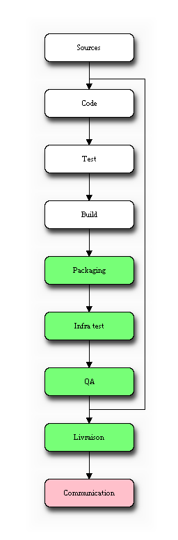
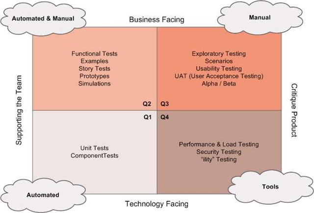

!SLIDE subsection

# La société

!SLIDE

# Editeur logiciel (Paris)

!SLIDE bullets

# Coeur de métier

 * Supervision réseau
 * Analyse de performance applicative 

!SLIDE bullets incremental

# On assure... 

* le développement (avec 99,9% de Libre) 
* le matériel 
* la logistique (envoi, RMA...) 
* le support 
* la formation 

!SLIDE bullets incremental

# A mon arrivée (08/2007)
* Modification en prod
* Pas de VCS
* Pas de release !
* Une appliance par développeurs
* Pas d&#39;environnement normalisé
* Pas de packaging

!SLIDE center

!SLIDE bullets

# Pour accentuer la difficulté
* IHM web
* Base de données
* Traffic réseau

!SLIDE bullets

# Quelques anti-patterns:
* Déploiement manuel
* Configuration manuel
* Déploiement sans tests
* Pas de rollback
* ...

!SLIDE

# 2008+ : développement du nouveau produit (from *scratch*)

!SLIDE subsection

# Notre pipeline

!SLIDE center

!SLIDE

# Ce pipeline est un flux
### (Kanban)

!SLIDE bullets

# Roadmap :
* 1 release interne / mois
* 1 release officielle / trimestre

!SLIDE bullets

# Release officielle :
* MAJ documentation
* Newsletter / site web... 
* Formation interne
* Q/A intensive

!SLIDE subsection

# Gestion des sources

!SLIDE

# La maitrise du code est obligatoire
### (au niveau organisationnelle)

!SLIDE bullets

# Etat des demandes :
* Ce qui est commencé
* Ce qui est terminé
* Ce qui est dans la branche principale

!SLIDE

# SVN est à proscrire

!SLIDE

# Impose un worflow unique sur toute la chaîne
### (pas de workflow perso, workflow orga basique)

!SLIDE 

# Impose des contraintes importantes

!SLIDE 

# Un déploiement très robuste et discipliné

!SLIDE 

# Une architecture qui récupère et isole les erreurs

!SLIDE 

# Capacité de rollback

!SLIDE 

# Des clients qui acceptent de «jouer» en prod

!SLIDE 

# Beaucoup de tests fonctionnels et de non-régressions

!SLIDE

# pour certains business, c&#39;est plus intéressant de déployer en prod
### (ex: gros site web)                         

!SLIDE

# Le DVCS permet au contraire de **choisir** son workflow orga...

!SLIDE center

!SLIDE subsection

# Environnement répétable

!SLIDE bullets

# Sur le poste du développeur
* Gestion des dépendences
* Gestion des applications
* Configuration dev / prod (FS, mode debug...)

!SLIDE bullets

# Nos outils : 
* Setuptools
* Buildout
* KGS

!SLIDE subsection

# Gestion du build

!SLIDE

# Bonnes pratiques de CI

!SLIDE bullets

# Nos outils : 
* Buildout
* Buildbot

!SLIDE subsection

# Packaging

!SLIDE

# Fournir un produit au client

!SLIDE bullets

# Nos outils :
* pbuilder (infra)
* create-package (générateur de package)
* ignite (sur les sondes)

!SLIDE bullets

# Package binaire :
* Gère le payload (MAJ soft / sys / données)
* Compresse
* Chiffre
* Rollback si erreur

!SLIDE subsection

# Test

!SLIDE center

!SLIDE subsection

# Infrastructure

!SLIDE

# Un développeur est capable de créer une sonde virtuelle en < 2mn

!SLIDE

# 7 Serveurs qui partagent 150 configuration de sondes virtuelles
### (Cloud du pauvre :)

!SLIDE

# Techno LXC
### (avant : Qemu, KVM, OpenVZ)

!SLIDE bullets

# + de sondes virtuelles :
* stable (dernière release officielle)
* ancienne stable
* beta (dernière release interne)
* 4 formations
* 4 partenaires
* sonde auto branches, trad...

!SLIDE

# Club R&D

!SLIDE subsection

# Configuration

!SLIDE bullets

# Tout est versionné :
* Script pour générer la version initiale
* Gestion de la migration

!SLIDE subsection

# Gestion des données

!SLIDE bullets

# Tout est versionné :
* Numéro de version dans la BD
* Changement incrémental
* Rollback
* Découplé de la migration applicative

!SLIDE subsection

# Livraison

!SLIDE bullets

# Process simple

!SLIDE bullets

# Génération d&#39;un binaire
* Produit
* Licence
* ServicePack

!SLIDE

# Upload sur le FTP de la sonde

!SLIDE subsection

# Communication

!SLIDE

# MAJ documentation

!SLIDE subsection

# Constat

!SLIDE

# Anectode probeconf

!SLIDE subsection

# Futur ?

!SLIDE bullets

# Quelques pistes :

* Intégration du manuel
* Cloud privé
* MAJ de l&#39;OS
* MAJ des applications
